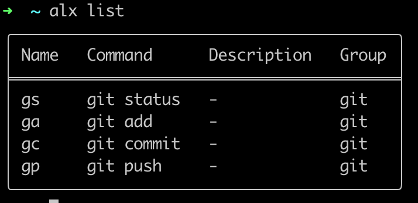

# alx



A simple alias manager for multiple shells written in Rust.

## Features

- 🚀 Manage aliases across multiple shells (Bash, Zsh, Fish)
- 📦 Group aliases by category
- 🔍 Search aliases by keyword
- 💾 Import / Export aliases (JSON, TOML)
- 🔄 Automatic sync to shell configuration

## Installation

Using Cargo install:

```bash
cargo install alx
```

## Quick Start

### 1. Initialize

```bash
alx init
```

### 2. Add to your shell config

First, run the `alx info` command, and then check the path for `Shell aliases`.

Add the following line to your shell configuration file:

**Bash** (`~/.bashrc`):

```bash
[ -f ~/your_alx_path/aliases.sh ] && source ~/your_alx_path/aliases.sh
```

**Zsh** (`~/.zshrc`):

```bash
[ -f ~/your_alias_path/aliases.sh ] && source ~/your_alias_path/aliases.sh
```

**Fish** (`~/.config/fish/config.fish`):

```fish
source ~/your_alias_path/aliases.sh
```

## Configuration

Initialization automatically creates the following structure in the alx directory.

```
~/your_alx_path/alx/
├── config.toml       # Main configuration
├── aliases.toml      # Aliases database
├── shell/
│   └── aliases.sh    # Generated shell aliases
└── backups/          # Backup directory
```

## Usage

### Show info

```bash
alx info
```

### Add an alias

```bash
alx add <name> <command> [--description] [--group]

# example
alx add ll "ls -la" --description "List all files" --group general
alx add gs "git status" --group git
```

### List aliases

```bash
alx list [--group]

# List all aliases
alx list

# List aliases in a specific group
alx list --group git
```

### Search aliases

```bash
alx search git
```

### Edit an alias

```bash
alx edit <name> [--command] [--description] [--group]

# example
alx edit ll --command "ls -lah"
alx edit gs --description "Check git status"
```

### Remove aliases

```bash
alx remove <name>

# example
alx remove ll gs
```

### Export / Import

This is useful for migrating external files or registering aliases in bulk.

```bash
# Export to JSON
alx export --output aliases.json --format json

# Export to TOML
alx export --output aliases.toml --format toml

# Import from fi
alx import aliases.json
```

### View groups

```bash
alx groups
```

## Migration guide

You can automatically apply settings from your current Bash shell configuration to alx.

Run the `alx migrate` command. This command targets files such as `.bashrc`, `.zshrc`, and `config.fish`, specifically focusing on `alias (ex: alias gs="git status")` definitions within those files.

```bash
# Initialize alx
alx init

# Migrate your target shell
alx migrate or alx migrate --from "./.bashrc"

# Check if the aliases are applied correctly
alx list
```

Remove the aliases from the shell settings, if there are no issues.

## Development

### Build

```bash
cargo build
```

### Run tests

```bash
cargo test
```

### Run

```bash
cargo run -- <command>
```

## License

MIT License.© [hiro08gh](https://github.com/hiro08gh)
